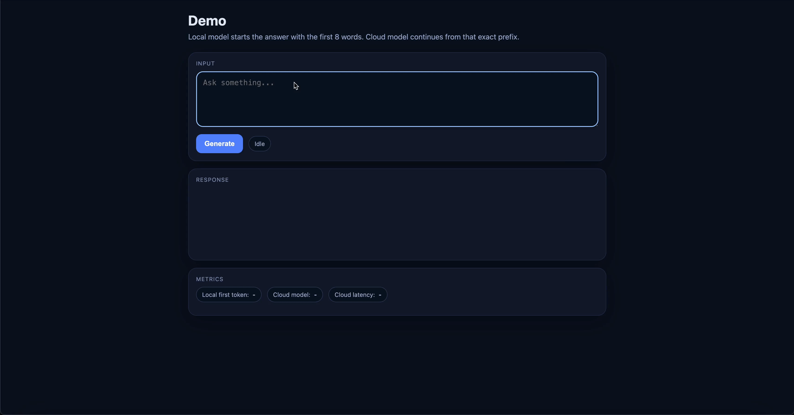

# Micro Language Models Enable Instant Responses
This is the official repo of our paper **Micro Language Models Enable Instant Responses**.

For more information, please refer to our [paper](https://arxiv.org/abs/2604.19642).

[](https://hits.sh/github.com/Sensente/micro_language_model_swen_project/)

# Demo

Our demo shows the local `micro lm (Swen)` generating the first `8` words, followed by `gpt-4o`, which completes the response from that prefix.



<!--  -->

# Model details

The model shown in the demo is our `28M` version model with 512 `hidden_size` and 8 `layers`.

## Model Checkpoint

Swen-28M is available on the Hugging Face Hub:

- [Sensente/Swen-28M](https://huggingface.co/Sensente/Swen-28M)

The Hugging Face release is validated with Transformers 4.x and can be loaded
using `AutoModelForCausalLM` with `trust_remote_code=True`.

# Run the demo

## Setup

Create and activate your environment, then install dependencies:

```bash
pip install -r requirements.txt
```

Copy env template:

```bash
cp .env.example .env
```

Then edit `.env` and fill in:

- `SWEN_CKPT`
- `SWEN_TOKENIZER`
- `OPENAI_API_KEY`

Load environment variables:

```bash
export $(grep -v '^#' .env | xargs)
```

## Run backend

From the repo root where `model/model_swen.py` is importable:

```bash
uvicorn backend.app:app --host 127.0.0.1 --port 8000 --reload
```

## Run frontend

In another terminal:

```bash
cd frontend
python -m http.server 3000
```

Open:

```text
http://127.0.0.1:3000
```

## How the continuation works

The backend first runs local decoding until it reaches at least 8 words. It then:

- shows that prefix immediately in the UI
- asks the model on the cloud to **continue after that prefix without repeating it**


# Citation
If you use this codebase, or our idea inspires your work, welcome cite:

```bibtex
@misc{cheng2026microlanguagemodelsenable,
      title={Micro Language Models Enable Instant Responses}, 
      author={Wen Cheng and Tuochao Chen and Karim Helwani and Sriram Srinivasan and Luke Zettlemoyer and Shyamnath Gollakota},
      year={2026},
      eprint={2604.19642},
      archivePrefix={arXiv},
      primaryClass={cs.CL},
      url={https://arxiv.org/abs/2604.19642}, 
}
